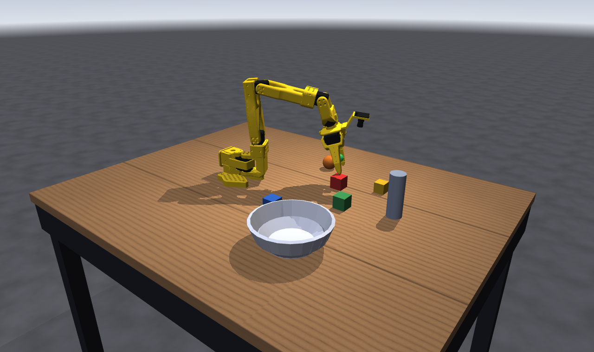

# SO-101 tabletop teleoperation (MuJoCo)

Drive the SO-101 — the `so101_new_calib_camera` variant, with the wrist camera —
around a table with a bowl, four cubes, a ball and a can, using the keyboard and
trackpad.



```bash
python Simulation/SO101/teleop.py
```

Needs `mujoco` and `glfw` (`pip install mujoco glfw`). Everything runs in a
plain GLFW window, so on macOS you use `python`, not `mjpython`.

## Controls

You do not drive joints; you drag a **target** for the gripper (the small green
sphere) and an IK solver works out the joint angles.

| | |
|---|---|
| `W` / `S` | move the target away from / toward the base |
| `A` / `D` | move it left / right |
| `Q` / `E` | raise / lower it |
| `←` / `→` | swing it around the base |
| `R` / `F` | pitch the gripper up / down |
| `Z` / `X` | roll the wrist |
| `G` / `B` | open / close the jaw |
| `Enter` | toggle the jaw open or shut |
| `Shift` | hold for fine motion |
| **left-drag** | drag the target in the plane of the screen |
| **`Shift` + left-drag** | drag it across the table instead |
| **`Alt` + left-drag** | aim the gripper — vertical drag pitches, horizontal rolls |
| **scroll** | push / pull the target away from you |
| **right-drag** | orbit the camera (two-finger click-drag on a trackpad) |
| **`Ctrl` + drag** | pan the camera |
| **`Ctrl` + scroll** | zoom |
| `Tab` | swap what left-drag and right-drag do |
| `J` | switch between Cartesian and joint-jog mode |
| `1`…`6`, `↑`/`↓` | in jog mode: pick a joint, then jog it |
| `[` / `]` | cycle cameras (free, overview, front, side, topdown, operator) |
| `C` | wrist camera picture-in-picture |
| `Home` | back to the home pose |
| `Backspace` | reset the scene |
| `Space` | pause physics |
| `F1` | show/hide the on-screen control list |
| `Esc` | quit |

The overlay in the top-left shows the target position, the gripper's pitch and
roll, the jaw command, and the IK residual. `OUT OF REACH` means the solver
could not reach where you asked; the target stops at the edge of the workspace
rather than running away from the arm.

## Picking things up

The jaws close **sideways** (along the gripper's z axis), so to grasp a cube
sitting on the table the wrist has to be rolled about 90° — that is why the home
pose starts with the jaws horizontal. A comfortable grasp is:

1. `Q`/`E` and the drag keys to park the target ~8 cm above the cube.
2. `R`/`F` until the pitch reads about 70–80°. A fully vertical (90°) approach is
   outside the wrist-flex range over much of the table — the arm has five joints,
   not six.
3. `G` to open the jaw to roughly `0.6`.
4. `E` to lower onto the cube, then `B` to close.
5. `Q` to lift.

`python teleop.py --selftest` runs exactly that sequence headless — pick up
`cube_red`, carry it over, drop it in the bowl — and reports pass/fail. Useful
as a regression check after changing the scene or the solver.

## How it works

- **`tabletop_scene.xml`** includes `so101_new_calib_camera.xml` and adds the
  table, props, lights and cameras. Generated by `make_scene.py` (see below),
  loadable on its own with `python -m mujoco.viewer --mjcf=...`.
- **IK** is damped least squares on *position plus approach direction*, warm-started
  from the previous solution. Yaw is slaved to the target's azimuth, which is
  exactly what the base pan joint does. The approach direction is weighted well
  below position, so near the edge of the workspace the solver keeps the gripper
  where you put it and lets it tilt — which is what you want when teleoperating.
- **Wrist roll** is commanded straight through as the joint it is, rather than
  being folded into a full 6D orientation task the arm cannot satisfy.
- **The wrist camera** is attached at load time via `MjSpec` (MJCF cannot bolt a
  camera onto a body that came from an `include`). Its pose is derived from the
  model — placed just in front of the lens housing and aimed at the grasp point
  — rather than hard-coded.
- **Jaw torque is limited to 0.8 N·m.** The model ships the jaw actuator with the
  same 3.35 N·m limit as the shoulder; at that torque, clamping down on a rigid
  cube stores enough energy in the contact to fling it across the table when you
  open again. The lower limit is still ample for anything here, and it stalls
  instead of exploding.

## Regenerating assets

Both generators write into this directory and are only needed if you want to
change the scene:

```bash
python Simulation/SO101/make_textures.py   # wood + concrete PNGs in assets/textures/
python Simulation/SO101/make_scene.py      # tabletop_scene.xml
```

The scene is generated because the bowl is assembled from a ring of tilted box
staves. A single bowl mesh would be reduced to its convex hull for collision and
nothing could be dropped into it.
